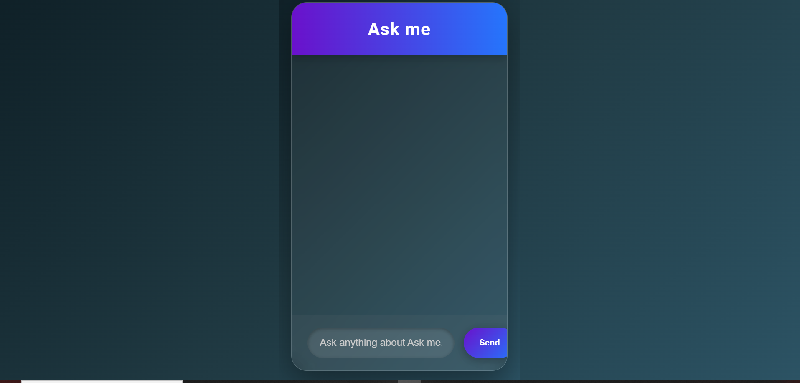
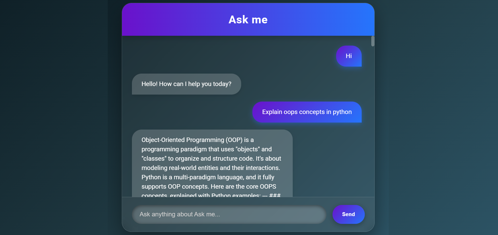

# Ask Me

Ask Me is an elegant, full-screen AI chatbot built using Flask, Python, and Gemini API.
It provides professional, line-by-line answers to your questions with a modern, interactive interface.

# Features

Powered by LLM (Gemini API) – provides expert answers to user questions.

Line-by-line responses – answers appear gradually for readability.

Elegant full-screen UI – modern glassmorphism design.

Typing indicator – shows when the bot is generating a response.

Responsive design – works on desktop and mobile.

Easy deployment – ready for local or cloud deployment (Render, Heroku, GCP, etc.).

# How it Works

User types a question in the chat interface.

Flask backend receives the message via /chat route.

Flask sends the question to Gemini LLM API.

Gemini returns a text response.

The response is split line by line and displayed gradually in the frontend.

# Flow Diagram:

User → Frontend UI → Flask Backend → Gemini LLM → Backend → Frontend → User

# Installation

Clone the repository:

git clone https://github.com/yourusername/ask-me.git
cd ask-me

Create a virtual environment (recommended):

python -m venv venv
source venv/bin/activate  # Linux/Mac
venv\Scripts\activate     # Windows

# Install dependencies:

pip install -r requirements.txt

Add your Gemini API key in config.py:

GEMINI_API_KEY = "YOUR_GEMINI_API_KEY_HERE"

Run the Flask app:

python app.py

Open your browser at http://127.0.0.1:5000.

# Usage

Type any question, e.g.:

"Explain a D flip-flop"

"What is a full adder?"

"How does an AND gate work?"

The bot will respond line by line, giving a professional explanation.

# Screenshots
# image 1

# image 2

# image 3

(Add actual screenshots or GIFs in your repository for better presentation.)

# Deployment

Locally: just run python app.py.

Cloud Platforms: Render, Heroku, or Google Cloud Run.

Make sure to set your Gemini API key as an environment variable or in config.py.
